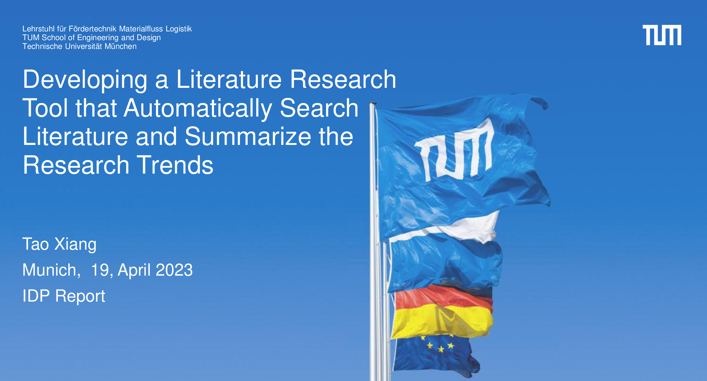

<link rel="stylesheet" type="text/css" href="./assets/timeline.css">
<link rel="stylesheet" type="text/css" href="./assets/toc.css">
<!-- <link rel="stylesheet" type="text/css" href="./assets/test.css"> -->

---
<!-- page 2 -->

# Table of Contents

### 1. Motivation
### 2. Introduction
### 3. Framework Design
### 4. Evaluation & Results
### 5. Limitations & Future Work

---
<!-- page 3 -->

# Table of Contents

### 

 1. Motivation

### 2. Introduction
### 3. Framework Design
### 4. Evaluation & Results
### 5. Limitations & Future Work

---

# Motivation
<ul class="timeline">
  <li class="timeline-item">
    

    

      <h4>Research trends are important</h4>
      By researching trends, we can stay ahead of the curve and ensure that our work is always <b>cutting-edge</b>.
    

  </li>
</ul>

---

# Motivation
<ul class="timeline">
  <li class="timeline-item">
    

    

      <h4>Research trends are important</h4>
      By researching trends, we can stay ahead of the curve and ensure that our work is always <b>cutting-edge</b>.
    

  </li>

  <li class="timeline-item">
    

    

      <h4>Challenges in identifying research trends</h4>
<ul>
  <li><b>Lack of standardization</b>: Research data is often presented in different formats and with different terminologies, making it difficult to compare and analyze.</li>
  <li><b>Information overload</b>: With the sheer volume of research being produced every day, it can be difficult to know where to start looking for trends.</li>
  <li><b>Noise in the data</b>: Not all research is equally important or reliable, and it can be difficult to filter out the irrelevant or low-quality studies.</li>
  <li><b>Changing landscape</b>: Research trends can shift rapidly in response to new discoveries and technologies, making it difficult to keep up with the latest developments.</li>
</ul>
    

  </li>
</ul>

---

# Motivation
<ul class="timeline">
  <li class="timeline-item">
    

    

      <h4>Research trends are important</h4>
      By researching trends, we can stay ahead of the curve and ensure that our work is always <b>cutting-edge</b>.
    

  </li>

  <li class="timeline-item">
    

    

      <h4>Challenges in identifying research trends</h4>
<ul>
  <li><b>Lack of standardization</b>: Research data is often presented in different formats and with different terminologies, making it difficult to compare and analyze.</li>
  <li><b>Information overload</b>: With the sheer volume of research being produced every day, it can be difficult to know where to start looking for trends.</li>
  <li><b>Noise in the data</b>: Not all research is equally important or reliable, and it can be difficult to filter out the irrelevant or low-quality studies.</li>
  <li><b>Changing landscape</b>: Research trends can shift rapidly in response to new discoveries and technologies, making it difficult to keep up with the latest developments.</li>
</ul>
    

  </li>

  <li class="timeline-item">
    

    

      <h4>The need for an automated framework</h4>
      Automated literature search and analysis based on <b>machine learning</b> can save time and resources while ensuring accuracy.
    

  </li>
</ul>

---

# Table of Contents

### 1. Motivation
### 

 2. Introduction

### 3. Framework Design
### 4. Evaluation & Results
### 5. Limitations & Future Work

---

# Introduction

---

# Table of Contents

### 1. Motivation
### 2. Introduction
### 

 3. Framework Design

### 4. Evaluation & Results
### 5. Limitations & Future Work

---

# Table of Contents

### 1. Motivation
### 2. Introduction
### 3. Framework Design
### 

 4. Evaluation & Results

### 5. Limitations & Future Work

---

# Table of Contents

### 1. Motivation
### 2. Introduction
### 3. Framework Design
### 4. Evaluation & Results
### 

 5. Limitations & Future Work

