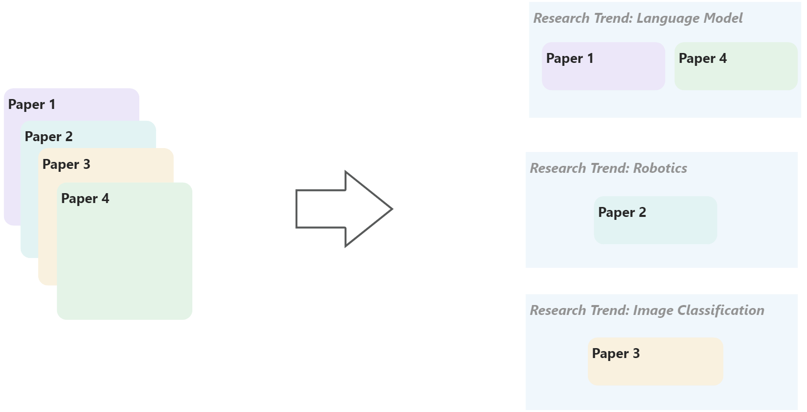
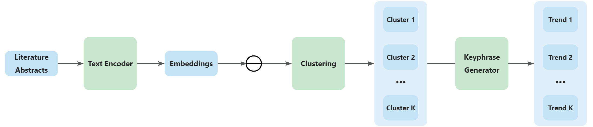
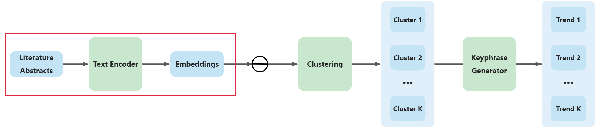
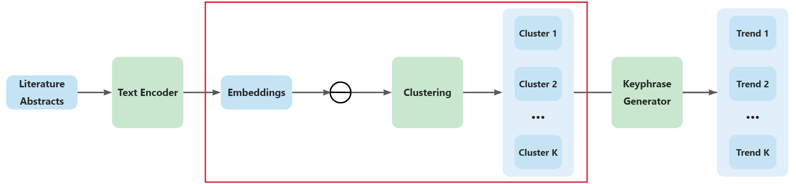
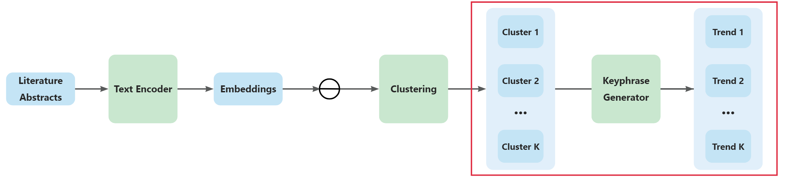

---

# Table of Contents

### 1. Motivation
### 2. Introduction
### 3. Framework Design
### 4. Evaluation & Results
### 5. Limitations & Future Work

---

# Table of Contents

### 

 1. Motivation

### 2. Introduction
### 3. Framework Design
### 4. Evaluation & Results
### 5. Limitations & Future Work

---

# Motivation
<ul class="timeline">
<li class="timeline-item">
                        

                        

                          <h4>Research trends are important</h4>
                          By researching trends, we can stay ahead of the curve and ensure that our work is always <b>cutting-edge</b>.
                        
</li></ul>

---

# Motivation
<ul class="timeline">
<li class="timeline-item">
                        

                        

                          <h4>Research trends are important</h4>
                          By researching trends, we can stay ahead of the curve and ensure that our work is always <b>cutting-edge</b>.
                        
</li><li class="timeline-item">
                        

                        

                          <h4>Challenges in identifying research trends</h4>
                          <ul>
  <li><b>Lack of standardization</b>: Research data is often presented in different formats and with different terminologies, making it difficult to compare and analyze.</li>
  <li><b>Information overload</b>: With the sheer volume of research being produced every day, it can be difficult to know where to start looking for trends.</li>
  <li><b>Noise in the data</b>: Not all research is equally important or reliable, and it can be difficult to filter out the irrelevant or low-quality studies.</li>
  <li><b>Changing landscape</b>: Research trends can shift rapidly in response to new discoveries and technologies, making it difficult to keep up with the latest developments.</li>
</ul>
                        
</li></ul>

---

# Motivation
<ul class="timeline">
<li class="timeline-item">
                        

                        

                          <h4>Research trends are important</h4>
                          By researching trends, we can stay ahead of the curve and ensure that our work is always <b>cutting-edge</b>.
                        
</li><li class="timeline-item">
                        

                        

                          <h4>Challenges in identifying research trends</h4>
                          <ul>
  <li><b>Lack of standardization</b>: Research data is often presented in different formats and with different terminologies, making it difficult to compare and analyze.</li>
  <li><b>Information overload</b>: With the sheer volume of research being produced every day, it can be difficult to know where to start looking for trends.</li>
  <li><b>Noise in the data</b>: Not all research is equally important or reliable, and it can be difficult to filter out the irrelevant or low-quality studies.</li>
  <li><b>Changing landscape</b>: Research trends can shift rapidly in response to new discoveries and technologies, making it difficult to keep up with the latest developments.</li>
</ul>
                        
</li><li class="timeline-item">
                        

                        

                          <h4>The need for an automated framework</h4>
                          Automated literature search and analysis based on <b>machine learning</b> can save time and resources while ensuring accuracy.
                        
</li></ul>

---

# Table of Contents

### 1. Motivation
### 

 2. Introduction

### 3. Framework Design
### 4. Evaluation & Results
### 5. Limitations & Future Work

---

# Introduction
To better understand the the task we are facing, we define the task of **Research Trend Analysis (RTA)** as follows:

**Definition** (Research Trend Analysis)
Consider a collection of literature papers $\mathcal{L} = {L_1, L_2, \ldots, L_n}$. The goal of research trend analysis is to identify $k$ research trends $T_1, T_2, \ldots, T_k$. Each research trend $T_i$ is characterized by a trend text $W_i$, which consists of phrases like "reinforcement learning", and a subset of literature papers $C_i \subseteq \mathcal{L}$ (i.e., a cluster) that belong to this trend.
    

---

# Introduction
To better understand the the task we are facing, we define the task of **Research Trend Analysis (RTA)** as follows:

**Definition** (Research Trend Analysis)
Consider a collection of literature papers $\mathcal{L} = {L_1, L_2, \ldots, L_n}$. The goal of research trend analysis is to identify $k$ research trends $T_1, T_2, \ldots, T_k$. Each research trend $T_i$ is characterized by a trend text $W_i$, which consists of phrases like "reinforcement learning", and a subset of literature papers $C_i \subseteq \mathcal{L}$ (i.e., a cluster) that belong to this trend.

        

---

# Research Questions
<ul class="boxline">
<li class="boxline-item">
    
1

    
<h2>How do we represent papers?</h2>

  </li>
<li class="boxline-item">
    
2

    
<h2>How do we determine the research trends from papers?</h2>

  </li>
<li class="boxline-item">
    
3

    
<h2>How do we evaluate the performance?</h2>

  </li>
</ul>

---

# Table of Contents

### 1. Motivation
### 2. Introduction
### 

 3. Framework Design

### 4. Evaluation & Results
### 5. Limitations & Future Work

---

# Framework Design - Overview (1)

    <h2>Text Encoding Module</h2>
    

      <ul><li>Encode paper abstracts into vectors</li><li>Use Transformer-based Encoder models</li><li>Tackle RQ 1</li></ul>
    

  

---

# Framework Design - Overview (2)

    <h2>Text Encoding Module</h2>
    

      <ul><li>Encode paper abstracts into vectors</li><li>Use Transformer-based Encoder models</li><li>Tackle RQ 1</li></ul>
    

  

    <h2>Clustering Module</h2>
    

      <ul><li>Cluster the paper abstracts</li><li>Use ML algorithms such as KMeans</li><li>Papers within the same cluster have similar research trends</li><li>Tackle RQ 2</li></ul>
    

  

---

# Framework Design - Overview (3)

    <h2>Text Encoding Module</h2>
    

      <ul><li>Encode paper abstracts into vectors</li><li>Use Transformer-based Encoder models</li><li>Tackle RQ 1</li></ul>
    

  

    <h2>Clustering Module</h2>
    

      <ul><li>Cluster the paper abstracts</li><li>Use ML algorithms such as KMeans</li><li>Papers within the same cluster have similar research trends</li><li>Tackle RQ 2</li></ul>
    

  

    <h2>Keyphrase Generator Module</h2>
    

      <ul><li>Generate Research Trends for each cluster</li><li>Use Transformer models</li><li>Tackle RQ 2</li></ul>
    

  

---

# Framework Design - Pipeline (1)

    

---

# Framework Design - Pipeline (2)

1. Every paper abstract is transformed into a 768-dimensional vector (embedding)
    

---

# Framework Design - Pipeline (3)

1. Every paper abstract is transformed into a 768-dimensional vector (embedding)
2. Embeddings are clustered based on their similarity, measured by distance
    

---

# Framework Design - Pipeline (4)

1. Every paper abstract is transformed into a 768-dimensional vector (embedding)
2. Embeddings are clustered based on their similarity, measured by distance
3. For each cluster, research trends are identified, generated, and summarized
   

---

# Framework Design - Text Encoding Module (1)

- Goal: Transform literature abstracts into vector representations for clustering     

---

# Framework Design - Text Encoding Module (2)

- Goal: Transform literature abstracts into vector representations for clustering
- Approach: Use transformer-based encoder models due to their exceptional performance
  - Examples of encoder models: BERT, RoBERTa, DistilBERT

---

# Framework Design - Text Encoding Module (3)

- Goal: Transform literature abstracts into vector representations for clustering
- Approach: Use transformer-based encoder models due to their exceptional performance
  - Examples of encoder models: BERT, RoBERTa, DistilBERT
- Selected model: all-mpnet-base-v2
  - Strong clustering performance
  - Moderate word embedding dimension (768)
  - Lower computational costs

---

# Framework Design - Clustering (1)

---
# Framework Design - Clustering (2)

- Clustering:
  - Groups similar literature abstracts
  - Algorithms used: K-Means, DBSCAN, Agglomerative Clustering, Gaussian Mixture Model (GMM), Spectral Clustering
    - determine or estimate the optimal number of clusters without prior specification

---
# Framework Design - Clustering (3)

- Clustering:
  - Groups similar literature abstracts
  - Algorithms used: K-Means, DBSCAN, Agglomerative Clustering, Gaussian Mixture Model (GMM), Spectral Clustering
    - determine or estimate the optimal number of clusters without prior specification
- Dimensionality Reduction:
  - High-dimensional vectors increase computational complexity and storage space requirements
  - Use PCA (Principal Component Analysis) to reduce dimensionality
    - only assumes normalized input data
    
---

# Framework Design - Keyphrase Generation (1)

---

# Framework Design - Keyphrase Generation (2)

- Keyphrase Generator:
  - Uses KeyBART for keyphrase generation
  - State-of-the-art performance on keyphrase generation and other NLP tasks
  - Fine-tuning with **manually annotated RTA dataset (90 samples)**

---

# Framework Design - Keyphrase Generation (3)

- Keyphrase Generator:
  - Uses KeyBART for keyphrase generation
  - State-of-the-art performance on keyphrase generation and other NLP tasks
  - Fine-tuning with **manually annotated RTA dataset (90 samples)**
- Adapters Technique:
  - Hard to fully fine-tune KeyBART model (560M parameters)
  - Integrates adapters with KeyBART to retain original knowledge
      - Adapter layers added between KeyBART's decoder layers
      - Experiments with hidden dimensions of 32, 64, 128, 256, and 512
  - **"KeyBART-adapter"**
    - 0.8M ~ 12M parameters

---

# Table of Contents

### 1. Motivation
### 2. Introduction
### 3. Framework Design
### 

 4. Evaluation & Results

### 5. Limitations & Future Work

---

# Evaluation & Results

We Have done 3 quantitative  experiments and 1 qualitative experiment.

---
# Evaluation & Results - Quantitative Experiments (1)

  1. Clustering Evaluation:
     - Performed on Abstract-Only dataset
     - Metrics: Adjusted Rand Index (ARI), Silhouette Score, Calinski-Harabasz Index (CHI)

---

# Evaluation & Results - Quantitative Experiments (2)

  1. Clustering Evaluation:
     - Performed on Abstract-Only dataset
     - Metrics: Adjusted Rand Index (ARI), Silhouette Score, Calinski-Harabasz Index (CHI)
  2. Ablation study on Dimensionality Reduction:
     - Compare clustering results with original high-dimensional and reduced-dimensional embeddings

---

# Evaluation & Results - Quantitative Experiments (3)

  1. Clustering Evaluation:
     - Performed on Abstract-Only dataset
     - Metrics: Adjusted Rand Index (ARI), Silhouette Score, Calinski-Harabasz Index (CHI)
  2. Ablation study on Dimensionality Reduction:
     - Compare clustering results with original high-dimensional and reduced-dimensional embeddings
  3. Research Trend Generation Evaluation:
     - Train KeyBART-adapter and KeyBART on RTA training set
     - Fine-tune hyperparameters using the validation set and experiment on test set
     - Metrics: F-score@M (harmonic mean of precision and recall for top-M generated keywords)

---
# Evaluation & Results - Quantitative Experiments (4)

## Clustering Evaluation Result

| Algorithm       | Adjusted Rand Index (ARI) | Silhouette Score | Calinski-Harabasz Index (CHI) |
|-----------------|---------------------|------------------|-------------------------|
| KMeans          | 0.6944              | **0.0843**       | **17.362**              |
| GMM             | **0.7202**           | 0.0839           | 17.356                  |
| DBSCAN          | -                   | -                | -                       |
| Agglomerative   | 0.6201              | 0.0782           | 16.261                  |
| Spectral        | 0.7087              | 0.0836           | 17.349                  |

- GMM performed best in Adjusted Rand Index
- KMeans scored highest in Silhouette Score and Calinski-Harabasz Index
- Choosing the best clustering algorithm depends on desired cluster qualities:
  - Higher intra-cluster similarity & Lower inter-cluster similarity (KMeans)
  - Closer alignment with ground truth labeling (GMM)

---
# Evaluation & Results - Quantitative Experiments (5)

## Ablation on Dimensionality Reduction Evaluation Result

| Algorithm        | Adjusted Rand Index (ARI) | Silhouette Score | Calinski-Harabasz Index (CHI) |
|------------------|---------------------|------------------|-------------------------|
| KMeans + PCA     | 0.6944              | 0.09061          | **18.410**              |
| GMM + PCA        | 0.7065              | **0.09064**      | 18.402                  |
| DBSCAN + PCA     | -                   | -                | -                       |
| Agglomerative + PCA | 0.6209          | 0.0841          | 17.212                  |
| Spectral + PCA   | **0.7087**          | 0.0900           | 18.395                  |

- Minimal impact of PCA on ARI
  - even a slight decrease for GMM
- Silhouette Score and CHI improve across all clustering algorithms
- Incorporating PCA may enhance overall clustering quality
  - Better intra-cluster similarity
  - Better inter-cluster dissimilarity

---
# Evaluation & Results - Quantitative Experiments (6)

## Research Trend Generation Evaluation Result

|                   | F-score@M (%) | Precision@M (%) | Recall@M (%) |
|-------------------|---------------|-----------------|--------------|
| KeyBART-adapter   | **33.25**     | **40.33**       | 30.07        |
| KeyBART           | 32.75         | 32.92           | **33.08**    |

KeyBART-adapter performs better in keyphrase generation overall
  - F-score@M and Precision@M are higher for KeyBART-adapter
  - KeyBART has a slightly higher Recall@M

---
# Evaluation & Results - Quantitative Experiments (6)

## Research Trend Generation Evaluation Result

|                   | F-score@M (%) | Precision@M (%) | Recall@M (%) |
|-------------------|---------------|-----------------|--------------|
| KeyBART-adapter   | **33.25**     | **40.33**       | 30.07        |
| KeyBART           | 32.75         | 32.92           | **33.08**    |

**In research trend analysis, precision is often more important than recall**
- Researchers prefer *fewer precise* trends over a larger set of related but less accurate ones
  - helps focus on the most critical developments in a field
- Considering precision, KeyBART-adapter is the more suitable model for research trend analysis.

---
# Evaluation & Results - Qualitative Experiments (1)

Human evaluation with 5 researchers from various domains

## Two steps in the evaluation process

1. Researchers given research trends and clusters generated by TrendFlow framework with two configurations:
    - Configuration 1: GMM clustering (no dimensionality reduction) and KeyBART-adapter for trend generation
    - Configuration 2: Same as Configuration 1 but with KeyBART for trend generation
2. Participants rate relevance, coherence of clusters, and accuracy of generated research trends on a 5-point Likert scale (1 is lowest, 5 is highest)

---

# Evaluation & Results - Qualitative Experiments (2)

    <h2>Relevance of Clusters</h2>
    

      <ul><li>Are the clusters meaningful or useful for the RTA task?</li></ul>
    

  

    <h2>Consistency of Clusters</h2>
    

      <ul><li>Are the data points within the same cluster similar to each other?</li></ul>
    

  

    <h2>Accuracy of Research Trends</h2>
    

      <ul><li>Do the generated research trends represent the actual trends?</li></ul>
    

  

---

    
# Evaluation & Results - Qualitative Experiments (3)

## Human Evaluation Result
| Configuration | Relevance of Clusters | Coherence of Clusters | Accuracy of Research Trends |
|---------------|-----------------------|-----------------------|-----------------------------|
| Conf1 (KeyBART-adapter)         | 4.66                  | 4.33                  | **4.33**                    |
| Conf2 (KeyBART)        | 4.66                  | 4.33                  | 4.16                        |

- Both configurations effectively cluster research topics
- KeyBART-adapter outperforms KeyBART in generating accurate research trends

---

# Aside: Web App Live Demo

https://huggingface.co/spaces/Adapting/TrendFlow

---

# Table of Contents

### 1. Motivation
### 2. Introduction
### 3. Framework Design
### 4. Evaluation & Results
### 

 5. Limitations & Future Work

---

# Limitations & Future Work

    <h2>Constrained summarization of generated research trends</h2>
    

      <ul><li>TrendFlow generates research trends for each paper within a single cluster, which can result in an overwhelming number of trends.</li><li>Refined post-processing of the generated research trends is necessary.</li><li>Current approach to grouping similar research trends: union-find algorithm.</li><li>Advanced methods (neural network-based) may be necessary to handle larger datasets.</li></ul>
    

  

---

# Limitations & Future Work

    <h2>Constrained summarization of generated research trends</h2>
    

      <ul><li>TrendFlow generates research trends for each paper within a single cluster, which can result in an overwhelming number of trends.</li><li>Refined post-processing of the generated research trends is necessary.</li><li>Current approach to grouping similar research trends: union-find algorithm.</li><li>Advanced methods (neural network-based) may be necessary to handle larger datasets.</li></ul>
    

  

    <h2>Domain-specific adaptations</h2>
    

      <ul><li>The RTA datasets were annotated by only sampling literature in machine learning and deep learning-related domains.</li><li>The TrendFlow framework's generalizability and adaptability to different research domains have not been extensively explored.</li><li>The framework's performance could potentially vary across different domains.</li><li>Further research should investigate whether domain-specific adaptations or customizations are necessary to optimize its performance across various fields of study.</li></ul>
    

  

---

# Limitations & Future Work

    <h2>Constrained summarization of generated research trends</h2>
    

      <ul><li>TrendFlow generates research trends for each paper within a single cluster, which can result in an overwhelming number of trends.</li><li>Refined post-processing of the generated research trends is necessary.</li><li>Current approach to grouping similar research trends: union-find algorithm.</li><li>Advanced methods (neural network-based) may be necessary to handle larger datasets.</li></ul>
    

  

    <h2>Domain-specific adaptations</h2>
    

      <ul><li>The RTA datasets were annotated by only sampling literature in machine learning and deep learning-related domains.</li><li>The TrendFlow framework's generalizability and adaptability to different research domains have not been extensively explored.</li><li>The framework's performance could potentially vary across different domains.</li><li>Further research should investigate whether domain-specific adaptations or customizations are necessary to optimize its performance across various fields of study.</li></ul>
    

  

    <h2>Scalability</h2>
    

      <ul><li>The TrendFlow framework's scalability and performance with large-scale datasets have not been thoroughly evaluated.</li><li>Increasing volume of research publications could pose challenges related to computational resources, processing time, and memory requirements.</li><li>Future work should consider optimizing the framework's performance and evaluating its scalability with larger datasets.</li></ul>
    

  

---

  <h1 style="margin: 0 auto;">&nbsp;&nbsp;&nbsp;&nbsp;&nbsp;&nbsp;&nbsp;&nbsp;&nbsp;&nbsp;&nbsp;&nbsp;&nbsp;&nbsp;&nbsp;&nbsp;&nbsp;&nbsp;&nbsp;&nbsp;&nbsp;&nbsp;&nbsp;&nbsp;&nbsp;&nbsp;&nbsp;&nbsp;&nbsp;&nbsp;&nbsp;&nbsp;&nbsp;&nbsp;Thanks for Attention! Any Questions?</h1>

